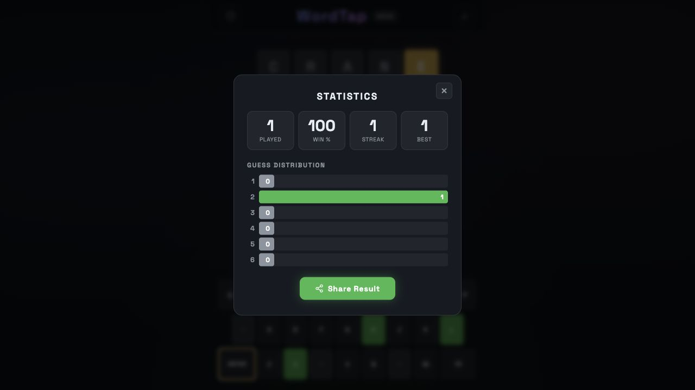

# WordTap

WordTap is a daily 5-letter word guessing game built with vanilla HTML, CSS, and JavaScript. Players get six guesses, color-coded tile feedback, persistent local stats, and a shareable result grid.

Live demo: https://briannab1997.github.io/wordtap

## Screenshot



## Features

- Daily puzzle selection based on the current date
- Six-guess word game loop with keyboard and on-screen input
- Two-pass tile scoring for repeated letters
- Valid-word checking before guesses are submitted
- Local statistics with win percentage, streaks, and guess distribution
- Shareable result text
- Responsive layout for desktop and mobile screens
- Help and statistics modals

## Tech Stack

- HTML5
- CSS3
- Vanilla JavaScript
- Browser localStorage

## Skills Demonstrated

- Custom game logic
- DOM interaction
- Keyboard and on-screen input handling
- Repeated-letter scoring edge cases
- Local statistics persistence
- Responsive front-end design
- JavaScript unit testing

## Run Locally

```bash
npm start
```

Then open:

```text
http://localhost:8000
```

The app is static, so it can also be served by any simple static file server.

## Test

```bash
npm test
```

The test suite checks the word lists and the core tile evaluation logic, including repeated-letter cases.

## Project Structure

```text
.
├── css/
│   └── style.css
├── js/
│   ├── app.js
│   ├── game.js
│   ├── stats.js
│   └── words.js
├── tests/
│   └── game.test.js
├── index.html
├── package.json
└── README.md
```

## Portfolio Notes

This project highlights front-end state management, DOM interaction, responsive styling, local persistence, and custom game logic without relying on a framework.
